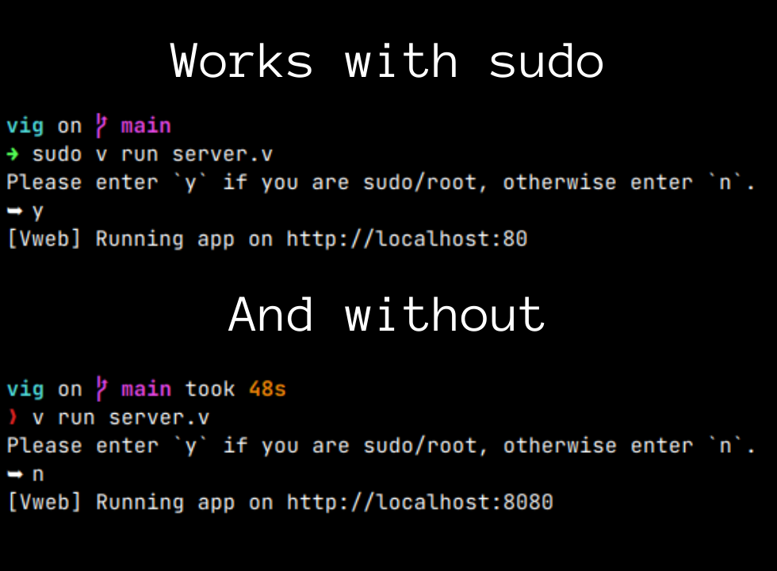

# V IP Logger (vil)
IP grabber for educational purposes only, built with V.

## Instructions
Clone the repository locally and run `v run server.v`.

## Forwarding
The easiest way to forward out to the web is to use [Ngrok](https://ngrok.io).

## Images

